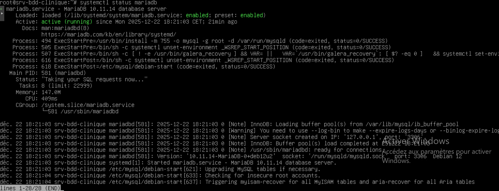
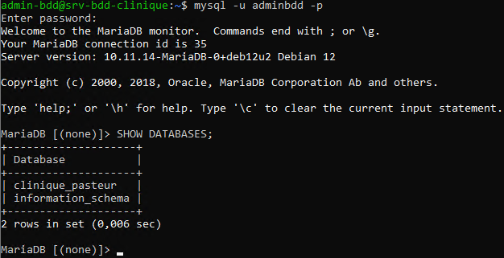

# 4. Installation et configuration de la base de données

## 4.1 Installation du service MariDB
Le service MariaDB a été installé sur le serveur Debain afin d'héberger la base de données de l'application

---

## 4.2 Création de la base de données
La base de données applicative a été créée afin de stocker les données du projet.

La base utilisée pour le projet est :
- `clinique_pasteur`

---

## 4.3 Création d’un utilisateur dédié

Un utilisateur dédié à l’administration de la base de données a été créé afin de limiter l’utilisation du compte root.

L’accès à la base a été testé avec succès.

