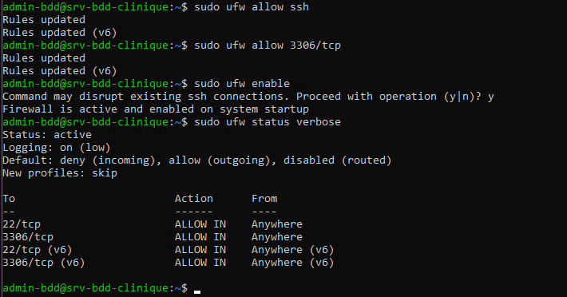

# 5. Sécurisation du serveur

## 5.1 Objectifs

La sécurisation du serveur permet de limiter les risques d’accès non autorisés et de protéger les données hébergées.

---

## 5.2 Pare-feu UFW

Un pare-feu UFW a été configuré afin de contrôler les connexions réseau vers le serveur.

Les règles mises en place autorisent uniquement :
- les connexions SSH
- les connexions nécessaires au service de base de données

---

## 5.3 Accès sécurisé

L’accès au serveur s’effectue via une connexion SSH avec un compte utilisateur dédié.  
L’utilisation du compte root est limitée afin de réduire les risques de compromission.

