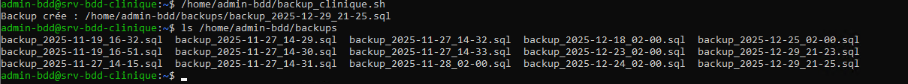

# 7. Rapport de tests

## 7.1 Tests du serveur Debian

Le serveur Debian a été testé afin de vérifier son bon fonctionnement en mode texte et sa configuration réseau.

Résultat : serveur fonctionnel.

---

## 7.2 Tests de la base de données

Le service MariaDB a été vérifié et est opérationnel.  
La base de données applicative est accessible avec l’utilisateur dédié.

Résultat : base de données fonctionnelle.

---

## 7.3 Tests de la sécurisation

Le pare-feu UFW est actif et les règles de sécurité sont correctement appliquées.

Résultat : serveur sécurisé.

---

## 7.4 Tests des sauvegardes

Le script de sauvegarde a été exécuté avec succès.  
Les fichiers de sauvegarde sont générés automatiquement grâce à la tâche cron.

Résultat : sauvegardes fonctionnelles et automatisées.
